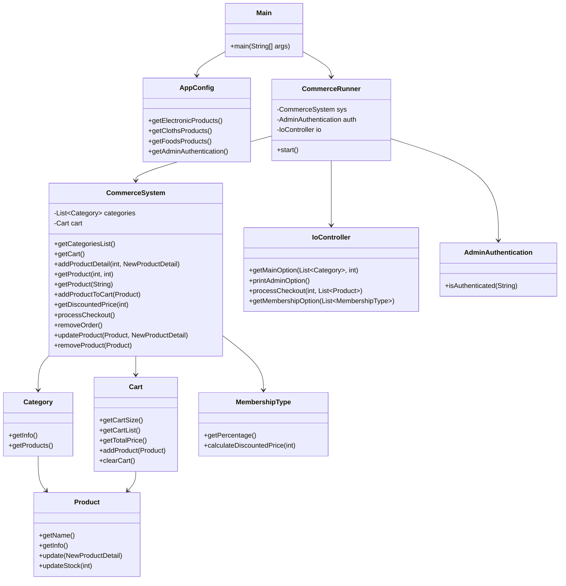

# basic-commerce

콘솔 기반 커머스 애플리케이션입니다. 상품 조회, 장바구니 관리, 결제, 관리자 상품 관리 기능을 제공합니다.

내일배움캠프 정규과정 자바 2차 과제입니다.

## 실행 방법

이 프로젝트는 별도의 빌드 도구 없이 `javac` / `java`로 실행할 수 있습니다.

### 1. 컴파일

터미널에서 다음 명령을 실행합니다
```bash
mkdir -p out
javac -d out $(find src/main -name "*.java")
```

### 2. 실행

터미널에서 다음 명령어를 실행합니다.

```bash
java -cp out main.Main
```

## 디렉토리 구조

현재 디렉토리 구조는 다음과 같습니다.

```text
basic-commerce/
├── README.md
└── src/
	└── main/
		├── Main.java
		├── config/
		│   └── AppConfig.java
		├── domain/
		│   ├── IterableOptions.java
		│   └── entity/
		│       ├── Cart.java
		│       ├── Category.java
		│       ├── Customer.java
		│       └── Product.java
		├── dto/
		│   └── NewProductDetail.java
		├── service/
		│   ├── AdminAuthentication.java
		│   ├── CommerceRunner.java
		│   ├── CommerceSystem.java
		│   └── IoController.java
		└── utility/
			└── MembershipType.java
```

## 클래스 다이어그램



## 구현 기능

### 사용자 기능

- 카테고리별 상품 조회
- 상품을 장바구니에 추가
- 장바구니 상품 삭제
- 결제 진행
- 회원 등급에 따른 할인 적용

### 관리자 기능

- 관리자 로그인
- 상품 등록
- 상품 수정
- 상품 삭제
- 전체 상품 조회

### 기타

- 카테고리 초기 데이터 세팅
- 콘솔 입력/출력 기반 UI 처리
- 장바구니 재고 반영 및 주문 완료 처리
